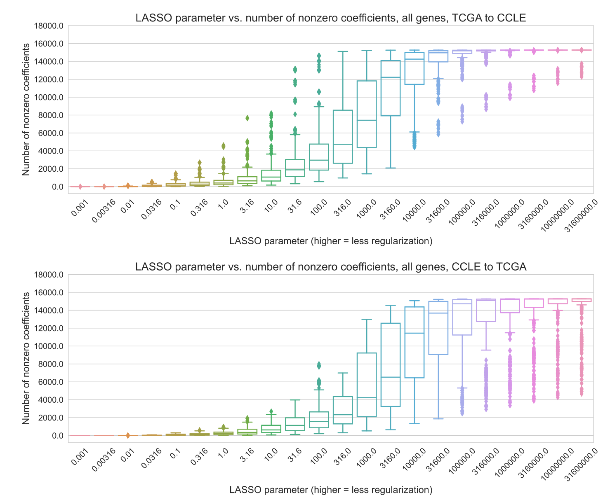

### Supplementary Material

{#fig:average_sparsity width="100%"}

{#fig:average_perf_by_gene width="100%" .page_break_before}

{#fig:thca_by_gene width="100%" .page_break_before}

{#fig:nn_dropout_wd width="100%" .page_break_before}
